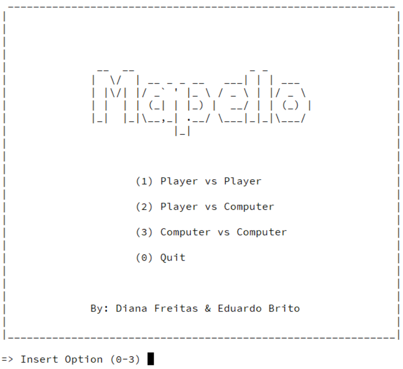
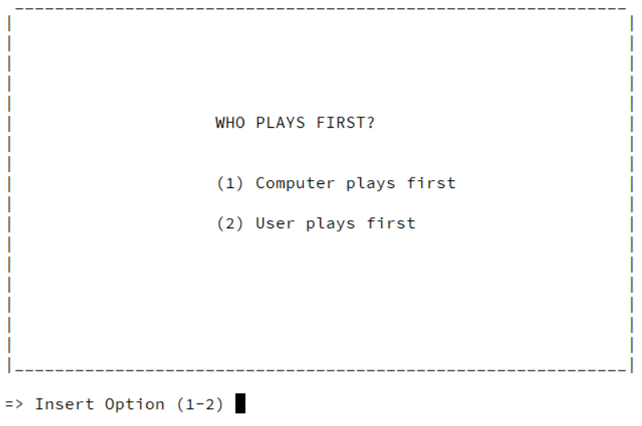
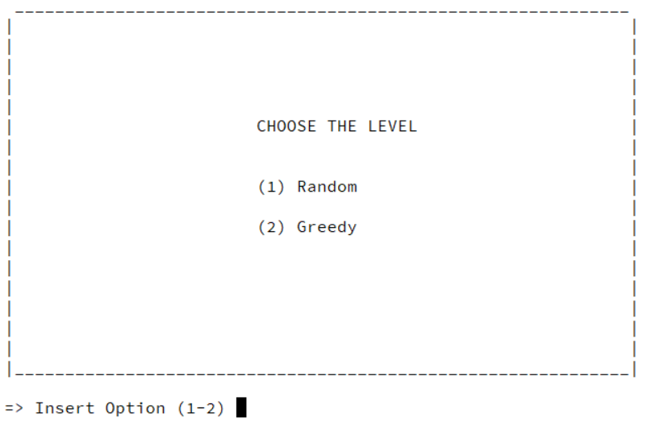
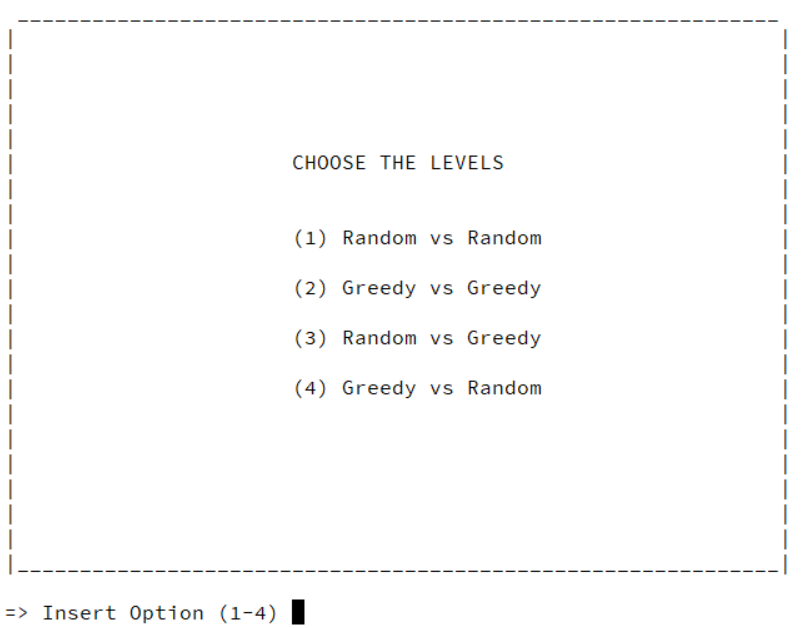
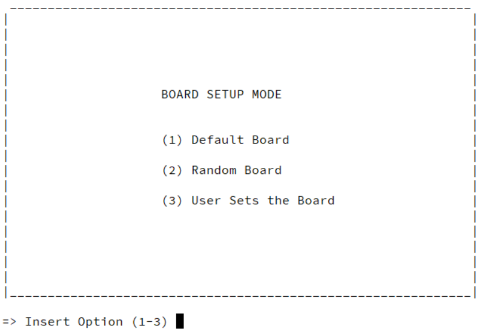

# PLOG_TP1_FINAL_T6_Mapello1

### Identificação
* Jogo: Mapello
* Turma: 6
* Grupo: Mapello1
* Elementos:
  * Diana Cristina Amaral de Freitas, [up201806230](up201806230@fe.up.pt)
  * Eduardo Ribas Brito, [up201806271](up201806271@fe.up.pt)

----

### Instalação e Execução​

Para a correta execução do jogo, usando SICStus Prolog versão 4.6, é necessário apenas definir o *working directory* do SICStus na pasta do jogo e utilizar a instrução `consult('mapello.pl')` ou `['mapello.pl'].`, seguida do predicado `play.`

----

### Descrição

#### Configuração do Tabuleiro

No jogo Mapello, destinado a 2 jogadores, as peças utilizadas são discos reversíveis **pretos** e **brancos**, sendo a cor voltada para cima a que identifica uma peça do jogador.
O tabuleiro, com uma configuração quadrangular de 10x10, é delimitado por **paredes**, correspondendo a área jogável ao centro do tabuleiro, 8x8. 
Nas quatro células centrais devem ser colocadas 2 peças de cada jogador, num padrão diagonal (*Imagem 1*). Na preparação do tabuleiro, podem ainda ser posicionadas outras peças, até um máximo de 8, de cada um dos seguintes tipos: 
- **paredes**, a cinzento, extra e imóveis, em qualquer posição da área jogável.
- **bónus**, a azul, que premeiam, com 3 pontos, o jogador que jogue sobre eles, em qualquer posição da área jogável.
- **jokers**, a vermelho, funcionando como peças do jogador atual, que só podem ser posicionados nos limites, fora da área jogável.

O jogador que não escolher o tabuleiro escolhe quem joga primeiro.


*1) Exemplo de uma possível configuração do tabuleiro* 

#### Regras do jogo

Os jogadores jogam alternadamente, começando o jogador de cor preta. Em cada jogada, o jogador posiciona uma peça num espaço vazio ou bónus, adjacente a uma peça do adversário.
As peças do adversário que fiquem, continuamente, entre a nova peça e uma outra peça do jogador atual, ou um joker, seja na diagonal, vertical ou horizontal, são viradas ao contrário, ficando da cor do jogador atual. 
Uma jogada válida tem que fazer com que pelo menos uma peça do adversário seja virada. Se o jogador não conseguir realizar uma jogada válida, passa a vez ao oponente.
O jogo termina quando nenhum dos jogadores tem jogadas válidas. Ao terminar, são contados os pontos somando o número de peças de cada jogador, presentes no tabuleiro, aos seus bónus acumulados, vencendo quem tiver mais pontos.

* Fontes usadas para a recolha de informação:
  * [Página Oficial](https://nestorgames.com/#mapello_detail)
  * [Livro de Regras](https://nestorgames.com/rulebooks/MAPELLO_EN.pdf)

----

### Representação Interna

#### 1. Átomos

Os átomos utilizados para representar as peças podem ser consultados no ficheiro `atoms.pl`. 

* Joker - **joker**
* Parede - **wall**
* Célula Vazia - **empty**
* Bonus - **bonus**
* Peça Branca - **white**
* Peça Preta - **black**

```prolog
% atom(?Piece, ?Symbol)
atom(joker, 'J').
atom(wall,  '#').
atom(empty, ' ').
atom(bonus, '*').
atom(white, 'O').
atom(black, 'X').
```

Existe ainda outro predicado que permite, rapidamente, identificar e obter as peças do jogador atual e seu oponente.

```prolog
% player(+PlayerId, -Name, -Piece, -OpponentPiece)
player(1, 'BLACK', black, white). 
player(-1, 'WHITE', white, black).
```

#### 2. Jogador e Bónus

O jogador de cor preta é representado internamente por 1 e o de cor branca por -1, sendo assim a mudança de jogador obtida pela negação do seu adversário.
Os bónus adquiridos pelos jogadores são atualizados a cada jogada e passados na chamada recursiva seguinte do loop de jogo.

#### 3. Tabuleiro

O tabuleiro de jogo é representado por uma lista de listas, em que cada célula contém uma das peças anteriores.

##### 3.1. Estado de jogo Inicial

```prolog
% initial(-Board)
initial([
[wall,  wall,  wall,  wall,  joker, wall,  wall,  wall,  wall, wall],
[wall,  wall,  empty, bonus, empty, empty, bonus, empty, wall, wall],
[wall,  empty, empty, empty, empty, empty, wall,  empty, empty, wall],
[joker, bonus, wall,  empty, empty, empty, empty, empty, bonus, joker],
[joker, empty, empty, empty, black, white, empty, empty, empty, wall],
[wall,  empty, empty, empty, white, black, empty, empty, bonus, wall],
[wall,  bonus, empty, empty, empty, empty, empty, wall,  empty, joker],
[joker, empty, empty, wall,  empty, empty, empty, empty, empty, wall],
[wall,  wall,  empty, bonus, empty, empty, empty, bonus, wall,  wall],
[wall,  wall,  wall,  joker, wall,  wall,  wall,  joker, wall,  wall]
]).
```

##### 3.2. Estado de jogo Intermédio

```prolog
intermediate([
[wall,  wall,  wall,  wall,  joker, wall,  wall,  wall,  wall, wall],
[wall,  wall,  empty, bonus, empty, empty, bonus, empty, wall, wall],
[wall,  empty, empty, empty, empty, empty, wall,  empty, empty, wall],
[joker, bonus, wall,  empty, empty, white, black, empty, bonus, joker],
[joker, empty, empty, empty, white, white, black, empty, white, wall],
[wall,  empty, empty, empty, black, white, black, white, bonus, wall],
[wall,  bonus, empty, empty, empty, white, white, wall,  empty, joker],
[joker, empty, empty, wall,  empty, white, black, empty, empty, wall],
[wall,  wall,  empty, bonus, empty, empty, empty, bonus, wall,  wall],
[wall,  wall,  wall,  joker, wall,  wall,  wall,  joker, wall,  wall]
]).
```

##### 3.3. Estado de jogo Final

```prolog
final([
[wall,  wall,  wall,  wall,  joker, wall,  wall,  wall,  wall, wall],
[wall,  wall,  black, black, black, black, black, white, wall, wall],
[wall,  black, black, black, black, black, wall,  black, white, wall],
[joker, white, wall,  black, white, white, black, black, black, joker],
[joker, white, white, black, black, black, white, black, black, wall],
[wall,  white, black, black, black, white, white, white, black, wall],
[wall,  white, white, black, white, black, white, wall,  black, joker],
[joker, white, white, wall,  black, black, black, black, black, wall],
[wall,  wall,  white, white, white, white, white, black, wall,  wall],
[wall,  wall,  wall,  joker, wall,  wall,  wall,  joker, wall,  wall]
]).
```

----

### Visualização

#### Predicados de Visualização

O predicado de visualização, `display_game(+GameState, +Player)`, recorre aos predicados do ficheiro `display.pl` para desenhar o estado de jogo, mostrando no ecrã o tabuleiro e o jogador atual.

```prolog
% display_game(+GameState, +Player) - Displays the current GameState of the board and the Player who plays next
display_game(GameState, Player):-
    nl,print_board(GameState),nl,  
    write('=============== '),
    player(Player, PlayerString, _, _),
    format('~s\'s turn', [PlayerString]),
    write(' ==============='), nl.
```

Para mostrar os pontos adquiridos através da captura de bónus utiliza-se o predicado `display_points(+BlackPoints, +WhitePoints)`.
```prolog
% display_points(+BlackPoints, +WhitePoints) - Prints Black and White Players' points
display_points(BlackPoints, WhitePoints):- 
    write('=> Black\'s Points: '), write(BlackPoints), nl,
    write('=> White\'s Points: '), write(WhitePoints), nl.
```

Para imprimir o tabuleiro, é utilizado o predicado `print_board(+GameState)` que, internamente, recorre a predicados auxiliares, `print_matrix(+Matrix, +N)` e `print_line(+Line)`, para imprimir o estado de jogo e os cabeçalhos das coordenadas.

```prolog
% print_board(+GameState) - Prints the current GameState of the board
print_board(GameState):-
    write('   ||   |   |   |   |   |   |   |   |   |   |\n'),
    write('   || 0 | 1 | 2 | 3 | 4 | 5 | 6 | 7 | 8 | 9 |\n'),
    write('===||===|===|===|===|===|===|===|===|===|===|\n'),
    print_matrix(GameState, 0).
```

O predicado `print_matrix(+Matrix, +N)` é responsável por imprimir, recursivamente, as 10 linhas do tabuleiro, chamando, para isso, o predicado `print_line(+Line)` que, por sua vez, imprime as 10 células de cada uma das linhas.

```prolog
% print_matrix(+Matrix, +N)
print_matrix([],10).
print_matrix([L|T], N):-
    N < 10,
    write(' '),
    letter(N, Letter), write(Letter),
    write(' ||'),
    N1 is N + 1,
    print_line(L), nl,
    write('---||---|---|---|---|---|---|---|---|---|---|\n'),
    print_matrix(T, N1).

% print_line(+Line)
print_line([]).
print_line([ID|L]):-
    write(' '),
    atom(ID, Symbol), write(Symbol),
    write(' |'),
    print_line(L).
```

#### Visualização dos Tabuleiros

##### Tabuleiro Inicial
|*Execução do código*|*Representação equivalente no jogo original*|
|--------------------|--------------------------------------------|
|||

##### Tabuleiro Intermédio
|*Execução do código*|*Representação equivalente no jogo original*|
|--------------------|--------------------------------------------|
|||

##### Tabuleiro Final
|*Execução do código*|*Representação equivalente no jogo original*|
|--------------------|--------------------------------------------|
|||


#### Menus e Input

O sistema de menus utilizado para definir o modo de jogo, os níveis dos computadores e o modo de geração do tabuleiro recorre, essencialmente, aos predicados do ficheiro `menu.pl`.


O menu inicial permite ao utilizador escolher o modo de jogo: **Jogador vs Jogador**, **Jogador vs Computador** ou **Computador vs Computador**. 




Escolhendo o modo **Jogador vs Computador**, o utilizador escolhe ainda quem joga primeiro (**Computador vs Jogador** ou **Jogador vs Computador**) e o nível de inteligência artificial do computador - ganancioso ou aleatório. 

|||
|--|---|


Já no modo **Computador vs Computador**, é possível escolher o nível de inteligência artificial de cada computador.




Finalmente, em qualquer um dos modos, o utilizador pode escolher se o tabuleiro é o padrão, se é gerado de forma aleatória ou se quer criar um tabuleiro personalizado, utilizando, neste último caso, alguns predicados do ficheiro `boards.pl` para pedir o número de peças e a sua posição ao utilizador.



Para pedir e validar o input recorremos aos predicados do ficheiro `input.pl`.

Para ler um inteiro é utilizado o predicado `get_int(-Input)` e para ler um caráter o predicado `get_character(-Input)`, descrevendo-se apenas o primeiro por serem muito semelhantes. Ambos os predicados tornam mais intuitiva a interação com o utilizador, validando o seu input e exigindo apenas a escrita da opção desejada seguida de 'ENTER'. 

```prolog
	get_int(Input) :- 
		% lê o próximo código sem o remover e verifica se não se trata de um Enter - caso em que o input está vazio
		peek_code(C),  C \= 10, 
		% lê o código removendo do buffer
		get_code(C),
		% verifica se o input é um único caráter, verificando se o próximo caráter é um 'newline'
		peek_char('\n'),
		% transforma o código lido no inteiro correspondente 
		Input is C - 48, 
		% limpa o resto do buffer
		!, skip_line.

	% imprime mensagem de erro se o input não é um inteiro nem um Enter, limpa o buffer e falha
	get_int(_):- 
		peek_code(C), 
		C \= 10, !, 
		write('ERROR: Invalid Input!\n\n'), 
		skip_line, fail.

	% imprime mensagem de erro no caso, limpa o buffer e falha no caso de o input ser um Enter
	get_int(_):- 
		write('ERROR: Invalid Input!\n\n'),  
		get_code(_), fail.
```

Os predicados que pedem input ao utilizador recorrem todos a uma estratégia semelhante: utilizam o predicado `repeat/0`, os dois predicados anteriores e um predicado para validar se o input se enquadra no que está a ser pedido, pedindo, repetidamente, o Input ao utilizador até este ser válido. Como exemplo, são realçados abaixo os predicados que pedem uma linha e uma coluna ao utilizador.

```prolog
% ask_row(-Row) - Asks the User for a valid Row
ask_row(Row):-
	repeat,
	write('=> Row: '),
	get_character(Input),
	validate_row(Input, Row), !.

% validate_row(+Input, -Row) - Validates the User Row Input
validate_row(Input, Row):- 
	letter(Row, Input).

validate_row(_, _) :- 
	write('ERROR: Invalid row!\n\n'), fail.
```
```prolog
% ask_col(-Col) - Asks the User for a valid Column
ask_col(Col):-
	repeat,
	write('=> Column: '),
	get_int(Input),
	validate_col(Input, Col), !.

% validate_col(+Input, -Input) - Validates the User Column Input
validate_col(Input, Input):- 
	between(0, 9, Input).
	
validate_col(_, _) :- 
	write('ERROR: Invalid Column!\n\n'), fail.
```

----

### Predicado Principal - Ciclo do Jogo

O predicado `game_loop` implementa o ciclo principal do jogo. Escolhendo o modo de jogo no menu inicial, o predicado vai receber o estado de jogo inicial, o jogador que joga primeiro, dois contadores para os pontos e o tipo de ambos os jogadores: 0 se o jogador for um utilizador, 1 se for um computador com nível *aleatório* e 2 se for um computador com nível *ganancioso*.
Se o jogador atual puder jogar é mostrado o estado de jogo e é pedida ou gerada uma jogada válida. A jogada é realizada obtendo-se o novo estado de jogo e a nova pontuação.Atualiza-se o jogador e chama-se novamente o loop de jogo.

```prolog
game_loop(GameState, P1, P2):- game_loop(GameState, 1, 0, 0, P1, P2).

game_loop(GameState, Player, BlackPoints, WhitePoints, P1, P2):-
	\+cant_play(GameState, Player),
	display_game(GameState, Player),
	display_points(BlackPoints, WhitePoints),
	repeat,
	ask_move(GameState, Player, P1, P2, Row, Col),
	move(GameState, [Player, Row, Col, BlackPoints, WhitePoints, NewBP, NewWP], NewGameState),
	NewPlayer is -Player, 
	game_loop(NewGameState, NewPlayer, NewBP, NewWP, P1, P2).
```

Se o jogador não puder jogar é passada a vez ao adversário se este tiver jogadas válidas. Caso o adversário também não possa jogar, é declarado o final do jogo.

```prolog
game_loop(GameState, Player, BlackPoints, WhitePoints, P1, P2):-
	NewPlayer is -Player,
	\+cant_play(GameState, NewPlayer),
	player(Player, PlayerString, _, _),
	format('\nNo valid moves for ~s player! Passing the turn...\n', [PlayerString]),
	game_loop(GameState, NewPlayer, BlackPoints, WhitePoints, P1, P2).

game_loop(GameState, _Player, BlackPoints, WhitePoints, _P1, _P2):-
	nl, print_board(GameState), nl,
	write('Game Over!\n'), nl,
	game_over(GameState-BlackPoints-WhitePoints, Winner),
	write(Winner), nl.
```

----

### Lista de Jogadas Válidas

A lista de jogadas válidas é obtida através do predicado `valid_moves(+GameState, +Player, -ListOfMoves)​` que contém uma chamada ao predicado built-in `setof`, gerador de uma lista ordenada de células onde a peça pode ser colocada. Estas jogadas estão ordenadas pelo seu valor, que representa a quantidade de peças do adversário a virar, somada ao eventual bónus que possa existir na célula.

```prolog
% valid_moves(+GameState, +Player, -ListOfMoves) - Get the ordered list of possible moves
valid_moves(GameState, Player, ListOfMoves):-
	setof(Val-Row-Col, 
		get_move(GameState, Player, Val-Row-Col), 
		ListOfMoves), !.

valid_moves(_, _, []).

% get_moves(+GameState, +Player, -Val-Row-Col) - Auxiliar predicate for the valid_moves setof
get_move(GameState, Player, Val-Row-Col):-
	between(1,8,Row), between(1,8,Col),
	valid_move(GameState, Player, Row, Col, S-_), 
	get_bonus_at(GameState,Row,Col,Bonus),
	Val is S + Bonus.
``` 

O predicado `valid_move(+GameState, +Player, +Move, -WouldTurn)` é responsável por verificar se a jogada corrente é válida, retornando a lista de peças do adversário que a jogada faria virar. A jogada é consumada se existir pelo menos uma peça do adversário que possa ser revertida, verificando em todas as direções as regras descritas em cima.

```prolog
valid_move(+GameState, +Player, +Move, -WouldTurn) - Check if a move is valid and return the cells of the pieces that it turns.
valid_move(GameState, Player, Row, Col, WouldTurn):-
	% cell is empty or with bonus
	(empty_cell(GameState, Row, Col); bonus_cell(GameState, Row, Col)),
	% gets the player's piece and the opponent's piece
	player(Player, _, PlayerPiece, OpponentPiece),
	% get all the opponent cells that would be turned
	would_turn(GameState, Row, Col, PlayerPiece, OpponentPiece, WouldTurnList),
	% check for at least one
	length(WouldTurnList, N),  N > 0,
	WouldTurn = N-WouldTurnList.
```

----

### Execução de Jogadas

A validação e execução de uma jogada, obtendo o novo estado do jogo, é feita através do predicado `​move(+GameState,+Move,-NewGameState)​`. Este recorre a vários predicados auxiliares que validam efetivamente a jogada, colocam a peça na célula e viram as peças do adversário afetadas pela jogada. Finalmente, são atualizados os pontos dos jogadores com o predicado `update_points`, que soma 3 pontos ao contador do jogador atual, caso este tenha posicionado a sua peça numa célula com bónus.

```prolog
% move(+GameState, +Move, -NewGameState) - Validates and executes a move, returning the new game state
move(GameState, [Player, Row, Col, BlackPoints, WhitePoints, NewBP, NewWP], NewGameState):-
	% check if cell is within limits
	within_limits(Row, Col),
	% validate the move
	valid_move(GameState, Player, Row, Col, _-WouldTurn), !,
	% get the player piece
	player(Player, _, Piece, _),
	% place the piece
	set_matrix_value(GameState, Row, Col, Piece, NGS1),
	% turn opponent's pieces
	turn_pieces(NGS1, WouldTurn, Piece, NewGameState),
	% finally update the points
	update_points(GameState, Row, Col, Player, BlackPoints, WhitePoints, NewBP, NewWP).

% If move is invalid then ask for another
move(_, _, _):- write('\n ERROR: Invalid move!\n'), fail.
``` 

----

### Final do Jogo

Para o jogo terminar é necessário que nenhum dos jogadores tenha jogadas válidas. Assim, antes de cada turno do jogo, é utilizado o predicado `cant_play(+GameState, +Player)`, que recorre, por sua vez, ao predicado `value(+GameState, +Player, -Value)`, para verificar se o jogador atual não tem jogadas válidas, isto é, se Value é nulo. Se não tiver, é dada a vez ao adversário e é verificado se este tem jogadas válidas. 

```prolog
% cant_play (+GameState, +Player) - Checks if the Current Player cannot play 
cant_play(GameState, Player):-
	value(GameState, Player, 0).
```

Se o jogador adversário também não conseguir realizar qualquer jogada válida, estamos perante o fim do jogo, utilizando-se o predicado `game_over(+GameState, -Winner)` para calcular e mostrar no ecrã os pontos finais dos jogadores e, deste modo, identificar o vencedor.

```prolog
% game_over(+GameState-BlackPoints-WhitePoints, -Winner) - Calculates the Points and Announces the Winner
game_over(GameState-BlackPoints-WhitePoints, Winner):-
	get_total_points(GameState-BlackPoints-WhitePoints, TotalBp, TotalWp),
	write('Final Points: '), nl,
	display_points(TotalBp, TotalWp),nl,
	get_winner(TotalBp, TotalWp, Winner).
```

----

### Avaliação do Tabuleiro

A avaliação do estado do jogo é feita pelo predicado `​value(+GameState, +Player, -Value)​` que calcula, neste caso, o número de jogadas válidas que podem ser realizadas pelo jogador atual. Caso não haja jogadas válidas - o tamanho da Lista é zero, é passada a vez ao adversário.

```prolog
% value(+GameState, +Player, -Value) - evaluate GameState: get number of valid moves for the current Player
value(GameState, Player, Value):-
	valid_moves(GameState, Player, ListOfMoves),
	length(ListOfMoves, Value).
```

----

### Jogada do Computador

A escolha da jogada a efetuar pelo computador, dependendo do nível de dificuldade, é feita pelo predicado  `choose_move(+GameState, +Player, +Level, -Move)`. Foram implementados dois níveis de dificuldade: o nível 1 *Random*, que escolhe uma jogada válida aleatória, e o nível 2 *Ganancioso*, que escolhe a melhor jogada no momento.

```prolog
% choose_move(+GameState, +Player, +Level, -Move) - Gets the Move from the computer depending on the level
% get a random valid move
choose_move(GameState, Player, 1, [Row,Col]):-
	valid_moves(GameState, Player, ListOfMoves),
	random_member(_-Row-Col, ListOfMoves).

% get the move that turns more pieces
choose_move(GameState, Player, 2, [Row,Col]):-
	valid_moves(GameState, Player, ListOfMoves),
	last(ListOfMoves, _-Row-Col).
```

----

### Conclusões

Como constatado, este trabalho foi desenvolvido seguindo todas as diretrizes enunciadas e aplicando todo o conhecimento acumulado, na linguagem Prolog. Os predicados enumerados na ficha do projeto foram todos implementados, bem como as várias especificidades requeridas. Como explicado, tentamos, a todo o custo, garantir uma boa experiência de utilização para o jogador, em termos da visualização e dos inputs, e os níveis de IA implementados garantem a diversidade suficiente de modos de jogo que podem ser explorados. A introdução inválida de dados é verificada em todas as situações e as regras do jogo original são seguidas em todos os pormenores.
Posto isto, damos como terminado este projeto.