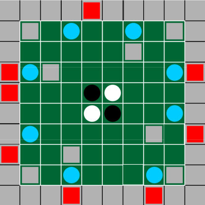
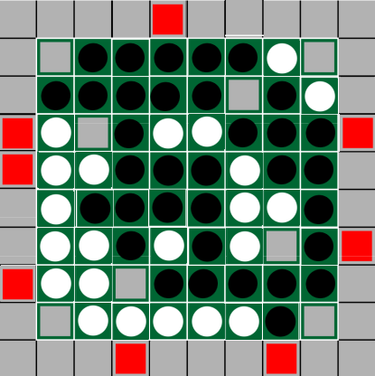

# PLOG_TP1_RI_T6_Mapello1

----
### Identificação
* Jogo: Mapello
* Turma: 6
* Grupo: Mapello1
* Elementos:
  * Diana Cristina Amaral de Freitas, up201806230
  * Eduardo Ribas Brito, up201806271
----
### Descrição

#### Regras:

O jogo Mapello é destinado a 2 jogadores, sendo cada um identificado por uma cor - **preto** ou **branco**.
As peças utilizadas são discos reversíveis pretos e brancos, sendo a metade voltada para cima a que identifica uma peça de um jogador no tabuleiro.
O tabuleiro, que tem uma configuração quadrangular de dimensões 10x10, é delimitado por **paredes** e por até **8 jokers**, que funcionam como peças do jogador que está a jogar.
Na área de jogo, no centro do tabuleiro com dimensões 8x8, são colocadas, inicialmente, 2 peças de cada cor nas células centrais e até **8 paredes** extra e **8 bónus** nas restantes células. Todas as outras células do tabuleiro ficam vazias.

Os jogadores jogam alternadamente, começando o jogador de cor preta. 
Em cada jogada, o jogador atual posiciona uma peça no tabuleiro. 
Todas as peças do adversário que estejam entre a nova peça e uma peça do jogador atual, que já estava no tabuleiro, incluindo jokers, seja na diagonal, vertical ou horizontal, são viradas ao contrário, ficando da cor de quem está a jogar. 
Uma jogada válida tem que fazer com que pelo menos uma das peças do adversário seja virada. Se o jogador não conseguir realizar uma jogada válida, a vez passa para o seu adversário.
Se o jogador posicionar uma peça sobre um bónus ganha 3 pontos.
O jogo termina quando nenhum dos jogadores puder realizar jogadas válidas, sendo o vencedor aquele que tiver mais peças no tabuleiro com a sua cor voltada para cima, adicionando os pontos relativos aos bónus capturados.

* Fontes usadas para a recolha de informação:
  * [Página Oficial](https://nestorgames.com/#mapello_detail)
  * [Livro de Regras](https://nestorgames.com/rulebooks/MAPELLO_EN.pdf)

----

### Representação Interna

1. Tabuleiro: Lista de listas
2. Átomos para as Peças: 
    * Peça Preta - B
    * Peça Branca - W
    * Paredes - #
    * Jokers - J
    * Célula Vazia - espaço(' ')
3. Jogador atual: após ser mostrada a representação do tabuleiro é indicado o jogador atual.
4. Bónus: os pontos conquistados pelo jogador atual, através da captura de bónus, são escritos no ecrã depois da representação do tabuleiro.

#### Exemplos de Representação 

##### Átomos

Os átomos utilizados para representar as peças podem ser consultados no ficheiro `atoms.pl`. Os átomos são identificados pelo *ID*, pelo seu símbolo *Symbol*, ou pelo seu número de ordem *N*.

```pl
% code(Id, Symbol, N)

code(joker, 'J', 0).
code(wall,  '#', 1).
code(empty, ' ', 2).
code(bonus, '*', 3).
code(white, 'W', 4).
code(black, 'B', 5).
```

##### Estados de jogo Iniciais

###### Tabuleiro Inicial

O tabuleiro inicial é devolvido pelo predicado `initial/1` (`initial(-GameState)`).

*Representação no código* 
```pl
initial([
[wall,  wall,  wall,  wall,  joker, wall,  wall,  wall,  wall, wall],
[wall,  wall,  empty, bonus, empty, empty, bonus, empty, wall, wall],
[wall,  empty, empty, empty, empty, empty, wall,  empty, empty, wall],
[joker, bonus, wall,  empty, empty, empty, empty, empty, bonus, joker],
[joker, empty, empty, empty, black, white, empty, empty, empty, wall],
[wall,  empty, empty, empty, white, black, empty, empty, bonus, wall],
[wall,  bonus, empty, empty, empty, empty, empty, wall,  empty, joker],
[joker, empty, empty, wall,  empty, empty, empty, empty, empty, wall],
[wall,  wall,  empty, bonus, empty, empty, empty, bonus, wall,  wall],
[wall,  wall,  wall,  joker, wall,  wall,  wall,  joker, wall,  wall]
]).
```
*Execução do código* 


*Representação equivalente no jogo original* 



###### Tabuleiro Inicial Random

No ficheiro `random.pl`, foram implementados predicados alternativos que permitem gerar um tabuleiro inicial aleatório, respeitando as especificações e o número máximo de peças de cada tipo, utilizadas no jogo. 
O predicado que devolve o estado inicial random do jogo, `initial/2` (`initial(r,-R)`) está, tal como os restantes estados de jogo, codificado no ficheiro `boards.pl`. São utilizados alguns predicados das bibliotecas `lists` e `random`, assim como predicados dinâmicos auxiliares, para a geração aleatória dos vários tipos de linhas do tabuleiro. 
As linhas do tipo 1 correspondem à primeira e última do tabuleiro, onde só figuram paredes, ou jokers. 
As linhas do tipo 2 são todas as linhas com casas jogáveis, mas ainda sem peças brancas ou pretas. 
Finalmente, as duas linhas do tipo 3 contém as duas peças iniciais de cada jogador, no centro do tabuleiro.

*Representação no código* 
```pl
% initial(r,-R)

initial(r,R) :- 
  maplist(restorePieces,[wall, joker, bonus]),
  maplist(lineType1, [LA,LJ]),
  maplist(lineType2, [LB,LI,LC,LH,LD,LG]),
  lineType3(LE, [black, white]),
  lineType3(LF, [white, black]),
  append([LA, LB, LC, LD, LE, LF, LG, LH, LI, LJ],[],R).
```

*Execução do código* 


##### Estado de jogo Intermédio

*Representação no código*
```pl
intermediate([
[wall,  wall,  wall,  wall,  joker, wall,  wall,  wall,  wall, wall],
[wall,  wall,  empty, bonus, empty, empty, bonus, empty, wall, wall],
[wall,  empty, empty, empty, empty, empty, wall,  empty, empty, wall],
[joker, bonus, wall,  empty, empty, white, black, empty, bonus, joker],
[joker, empty, empty, empty, white, white, black, empty, white, wall],
[wall,  empty, empty, empty, black, white, black, white, bonus, wall],
[wall,  bonus, empty, empty, empty, white, white, wall,  empty, joker],
[joker, empty, empty, wall,  empty, white, black, empty, empty, wall],
[wall,  wall,  empty, bonus, empty, empty, empty, bonus, wall,  wall],
[wall,  wall,  wall,  joker, wall,  wall,  wall,  joker, wall,  wall]
]).
```

*Execução do código* 


*Representação equivalente no jogo original* 


##### Estado de jogo Final

*Representação no código* 
```pl
final([
[wall,  wall,  wall,  wall,  joker, wall,  wall,  wall,  wall, wall],
[wall,  wall,  white, white, white, black, white, white, wall, wall],
[wall,  white, black, white, black, black, wall,  white, black, wall],
[joker, black, wall,  black, white, white, white, black, black, joker],
[joker, black, white, black, white, white, black, white, black, wall],
[wall,  black, white, black, white, black, black, white, black, wall],
[wall,  black, white, white, black, black, white, wall,  white, joker],
[joker, white, black, wall,  black, black, black, white, black, wall],
[wall,  wall,  black, black, white, white, white, white, wall,  wall],
[wall,  wall,  wall,  joker, wall,  wall,  wall,  joker, wall,  wall]
]).
```
*Execução do código* 


*Representação equivalente no jogo original* 


##### Jogador Atual e Pontuação

O predicado `player/3` é dinâmico pois, ao serem conquistados pontos por um jogador através da captura de bónus, a definição do predicado é alterada durante a execução. 

```pl
% player(PlayerId, Name, Points)

player(black, 'BLACK', 0). 
player(white, 'WHITE', 0).
```

Para adicionar os pontos correspondentes a um bónus é utilizado o predicado `addPlayerBonus/1` que, utilizando os predicados `assert/1` e `retract/1`, altera o predicado `player/3`, atualizando a pontuação do jogador, identificado pelo seu *ID*, na base de dados do Prolog.

```pl
% addPlayerBonus(+Id)

addPlayerBonus(Id) :-
    retract(player(Id,String,Old)),
    New is Old + 3,
    assert(player(Id,String,New)).
```

----

### Visualização

O predicado de visualização, `display_game(+GameState, +Player)`, recorre aos predicados do ficheiro `display.pl` para desenhar o estado de jogo. O jogador e os seus pontos são obtidos com o predicado `player(+Player, -PlayerString, -PlayerPoints)`.

```pl
% display_game(+GameState, +Player)

display_game(GameState, Player):-
  print_board(GameState),nl,  
  write('-------- '),
  player(Player, PlayerString, PlayerPoints),
  format('~s\'s turn | Has ~d points', [PlayerString, PlayerPoints]),
  write(' --------').
```

Para imprimir o tabuleiro é utilizado o predicado `print_board(+GameState)`. Este recebe o estado de jogo atual e utiliza, por sua vez, o predicado `write/1` para imprimir na consola o cabeçalho do tabuleiro, que irá facilitar, posteriormente, a escolha de uma célula pelo utilizador. Para além disso, recorre ao predicado `print_matrix(+Matrix, +N)` para imprimir o tabuleiro de jogo.

```pl
% print_board(+GameState)

print_board(GameState):-
    write('   | 0 | 1 | 2 | 3 | 4 | 5 | 6 | 7 | 8 | 9 |'),nl,
    write('---|---|---|---|---|---|---|---|---|---|---|'),nl,
    print_matrix(GameState, 0).
```

No predicado `print_matrix(+Matrix, +N)` é escrita, no ecrã, uma letra que identifica a linha, sendo a letra obtida com `letter(+N, -Letter)`. É ainda utilizado o predicado `print_line(+Line)` para imprimir a linha número N. A cada chamada, é impressa a linha correspondente à cabeça da lista, o valor de N é atualizado e é chamado o predicado recursivamente para imprimir a cauda da lista, até esta ficar vazia (caso base) - quando se atinge a 10ª linha do tabuleiro.

```pl
% print_matrix(+Matrix, +N)

print_matrix([],10).
print_matrix([L|T], N):-
  N < 10,
  write(' '),
  letter(N, Letter), write(Letter),
  write(' |'),
  N1 is N + 1,
  print_line(L), nl,
  write('---|---|---|---|---|---|---|---|---|---|---|'),nl,
  print_matrix(T, N1).
```

Por fim, no predicado recursivo `print_line(+Line)`, é impressa uma linha, célula por célula, até a lista que representa a linha ficar vazia. Para isso, obtém-se o símbolo que representa cada célula com o predicado `code(+Id, -Symbol, N)`.

```pl
% print_line(+Line)

print_line([]).
print_line([C|L]):-
  write(' '),
  code(C,P,_), write(P),
  write(' |'),
  print_line(L).
```

----

### Execução

O predicado principal é `play/0`, que imprime o estado de jogo inicial, no ecrã.
Existe, ainda, como foi referido, um predicado alternativo `play(r)` que imprime um tabuleiro inicial gerado aleatoriamente.