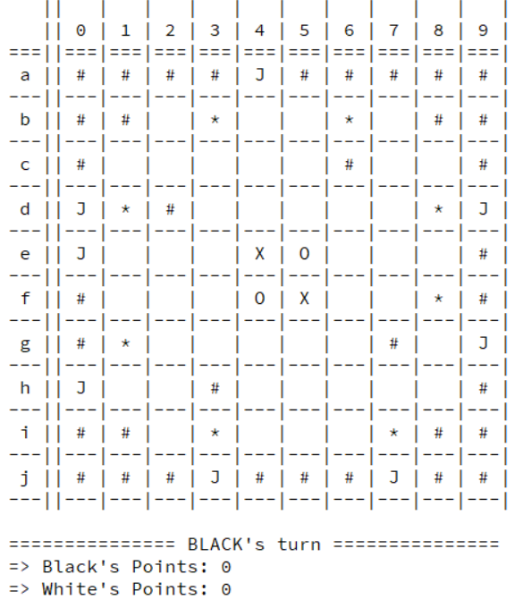
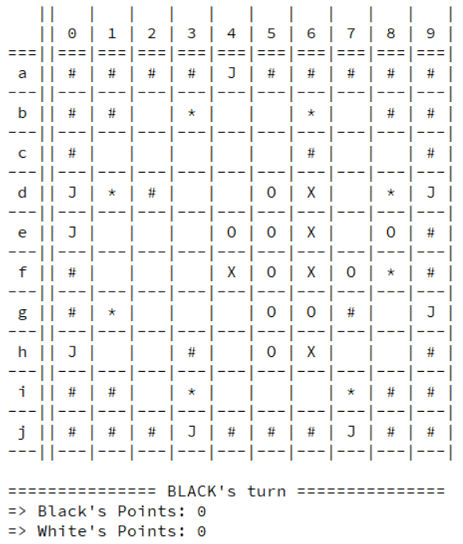

# PLOG_TP1_FINAL_T6_Mapello1

### Identificação
* Jogo: Mapello
* Turma: 6
* Grupo: Mapello1
* Elementos:
  * Diana Cristina Amaral de Freitas, [up201806230](up201806230@fe.up.pt)
  * Eduardo Ribas Brito, [up201806271](up201806271@fe.up.pt)

----

### Instalação e Execução​

Para a correta execução do jogo, usando SICStus Prolog versão 4.6, é necessária apenas a instrução `['mapello.pl'].` seguida do predicado `play.`

----

### Descrição

#### Configuração do Tabuleiro

No jogo Mapello, destinado a 2 jogadores, as peças utilizadas são discos reversíveis **pretos** e **brancos**, sendo a cor voltada para cima a que identifica uma peça do jogador.
O tabuleiro, com uma configuração quadrangular de 10x10, é delimitado por **paredes**, correspondendo a área jogável ao centro do tabuleiro, 8x8. 
Nas quatro células centrais devem ser colocadas 2 peças de cada jogador, num padrão diagonal. Na preparação do tabuleiro, podem ainda ser posicionadas outras peças, até um máximo de 8, de cada um dos seguintes tipos: 
- **paredes**, a cinzento, extra e imóveis, em qualquer posição da área jogável.
- **bónus**, a azul, que premeiam, com 3 pontos, o jogador que jogue sobre eles, em qualquer posição da área jogável.
- **jokers**, a vermelho, funcionando como peças do jogador atual, que só podem ser posicionados nos limites, fora da área jogável.

O jogador que não escolher o tabuleiro escolhe quem joga primeiro.


*Exemplo de uma possível configuração do tabuleiro* 

#### Regras do jogo

Os jogadores jogam alternadamente, começando o jogador de cor preta. Em cada jogada, o jogador posiciona uma peça num espaço vazio ou bónus, adjacente a uma peça do adversário.
As peças do adversário que fiquem, continuamente, entre a nova peça e uma outra peça do jogador atual, ou um joker, seja na diagonal, vertical ou horizontal, são viradas ao contrário, ficando da cor do jogador atual. 
Uma jogada válida tem que fazer com que pelo menos uma peça do adversário seja virada. Se o jogador não conseguir realizar uma jogada válida, passa a vez ao oponente.
O jogo termina quando nenhum dos jogadores tem jogadas válidas. Ao terminar, são contados os pontos somando o número de peças de cada jogador, presentes no tabuleiro, aos seus bónus acumulados, vencendo quem tiver mais pontos.

* Fontes usadas para a recolha de informação:
  * [Página Oficial](https://nestorgames.com/#mapello_detail)
  * [Livro de Regras](https://nestorgames.com/rulebooks/MAPELLO_EN.pdf)

----

### Representação Interna

#### 1. Átomos

Os átomos utilizados para representar as peças podem ser consultados no ficheiro `atoms.pl`. Os átomos são identificados pela peça *Piece* e pelo seu símbolo *Symbol*. 

* Joker - **joker**
* Parede - **wall**
* Célula Vazia - **empty**
* Bonus - **bonus**
* Peça Branca - **white**
* Peça Preta - **black**

```prolog
% atom(?Piece, ?Symbol)
atom(joker, 'J').
atom(wall,  '#').
atom(empty, ' ').
atom(bonus, '*').
atom(white, 'O').
atom(black, 'X').
```

Existe ainda outro predicado que permite, rapidamente, identificar e obter as peças do jogador atual e seu oponente.

```prolog
% player(+PlayerId, -Name, -Piece, -OpponentPiece)
player(1, 'BLACK', black, white). 
player(-1, 'WHITE', white, black).
```

#### 2. Tabuleiro

O tabuleiro de jogo é representado por uma lista de listas, em que cada célula contém uma das peças anteriores.

##### 2.1. Estado de jogo Inicial

```prolog
% initial(-Board)
initial([
[wall,  wall,  wall,  wall,  joker, wall,  wall,  wall,  wall, wall],
[wall,  wall,  empty, bonus, empty, empty, bonus, empty, wall, wall],
[wall,  empty, empty, empty, empty, empty, wall,  empty, empty, wall],
[joker, bonus, wall,  empty, empty, empty, empty, empty, bonus, joker],
[joker, empty, empty, empty, black, white, empty, empty, empty, wall],
[wall,  empty, empty, empty, white, black, empty, empty, bonus, wall],
[wall,  bonus, empty, empty, empty, empty, empty, wall,  empty, joker],
[joker, empty, empty, wall,  empty, empty, empty, empty, empty, wall],
[wall,  wall,  empty, bonus, empty, empty, empty, bonus, wall,  wall],
[wall,  wall,  wall,  joker, wall,  wall,  wall,  joker, wall,  wall]
]).
```

##### 2.2. Estado de jogo Intermédio

```prolog
intermediate([
[wall,  wall,  wall,  wall,  joker, wall,  wall,  wall,  wall, wall],
[wall,  wall,  empty, bonus, empty, empty, bonus, empty, wall, wall],
[wall,  empty, empty, empty, empty, empty, wall,  empty, empty, wall],
[joker, bonus, wall,  empty, empty, white, black, empty, bonus, joker],
[joker, empty, empty, empty, white, white, black, empty, white, wall],
[wall,  empty, empty, empty, black, white, black, white, bonus, wall],
[wall,  bonus, empty, empty, empty, white, white, wall,  empty, joker],
[joker, empty, empty, wall,  empty, white, black, empty, empty, wall],
[wall,  wall,  empty, bonus, empty, empty, empty, bonus, wall,  wall],
[wall,  wall,  wall,  joker, wall,  wall,  wall,  joker, wall,  wall]
]).
```

##### 2.3. Estado de jogo Final

```prolog
final([
[wall,  wall,  wall,  wall,  joker, wall,  wall,  wall,  wall, wall],
[wall,  wall,  white, white, white, black, white, white, wall, wall],
[wall,  white, black, white, black, black, wall,  white, black, wall],
[joker, black, wall,  black, white, white, white, black, black, joker],
[joker, black, white, black, white, white, black, white, black, wall],
[wall,  black, white, black, white, black, black, white, black, wall],
[wall,  black, white, white, black, black, white, wall,  white, joker],
[joker, white, black, wall,  black, black, black, white, black, wall],
[wall,  wall,  black, black, white, white, white, white, wall,  wall],
[wall,  wall,  wall,  joker, wall,  wall,  wall,  joker, wall,  wall]
]).
```

----

### Visualização

#### Predicados de Visualização

O predicado de visualização, `display_game(+GameState, +Player)`, recorre aos predicados do ficheiro `display.pl` para desenhar o estado de jogo, mostrando no ecrã o tabuleiro e o jogador atual.

```prolog
% display_game(+GameState, +Player) - Displays the current GameState of the board and the Player who plays next
display_game(GameState, Player):-
    print_board(GameState),nl,  
    write('=============== '),
    player(Player, PlayerString),
    format('~s\'s turn', [PlayerString]),
    write(' ==============='), nl.
```

Para imprimir o tabuleiro, é utilizado o predicado `print_board(+GameState)` que, internamente, recorre a predicados auxiliares, `print_matrix(+Matrix, +N)` e `print_line(+Line)`, para imprimir o estado de jogo e os cabeçalhos das coordenadas.

```prolog
% print_board(+GameState) - Prints the current GameState of the board
print_board(GameState):-
    write('   |   |   |   |   |   |   |   |   |   |   |\n'),
    write('   | 0 | 1 | 2 | 3 | 4 | 5 | 6 | 7 | 8 | 9 |\n'),
    write('===|===|===|===|===|===|===|===|===|===|===|\n'),
    print_matrix(GameState, 0).
```

O predicado `print_matrix(+Matrix, +N)` é responsável por imprimir, recursivamente, as 10 linhas do tabuleiro, chamando, para isso, o predicado `print_line(+Line)` que, por sua vez, imprime as 10 células de cada uma das linhas.

```prolog
% print_matrix(+Matrix, +N)
print_matrix([],10).
print_matrix([L|T], N):-
    N < 10,
    write(' '),
    letter(N, Letter), write(Letter),
    write(' |'),
    N1 is N + 1,
    print_line(L), nl,
    write('---|---|---|---|---|---|---|---|---|---|---|\n'),
    print_matrix(T, N1).

% print_line(+Line)
print_line([]).
print_line([ID|L]):-
    write(' '),
    atom(ID, Symbol), write(Symbol),
    write(' |'),
    print_line(L).
```

#### Visualização dos Tabuleiros

##### Tabuleiro Inicial
|*Execução do código*|*Representação equivalente no jogo original*|
|--------------------|--------------------------------------------|
|||

##### Tabuleiro Intermédio
|*Execução do código*|*Representação equivalente no jogo original*|
|--------------------|--------------------------------------------|
|||

##### Tabuleiro Final
|*Execução do código*|*Representação equivalente no jogo original*|
|--------------------|--------------------------------------------|
|||


#### Menus e Input


----

### Lista de Jogadas Válidas

A lista de jogadas válidas é obtida através do predicado `valid_moves(+GameState, +Player, -ListOfMoves)​` que contém uma chamada ao predicado built-in `setof`, gerador de uma lista ordenada de células onde a peça pode ser colocada. Estas jogadas estão ordenadas pelo seu valor, que representa a quantidade de peças do adversário a virar, somada ao eventual bónus que possa existir na célula.

```prolog
% valid_moves(+GameState, +Player, -ListOfMoves) - Get the ordered list of possible moves
valid_moves(GameState, Player, ListOfMoves):-
	setof(Val-Row-Col, 
		get_move(GameState, Player, Val-Row-Col), 
		ListOfMoves), !.

valid_moves(_, _, []).

% get_moves(+GameState, +Player, -Val-Row-Col) - Auxiliar predicate for the valid_moves setof
get_move(GameState, Player, Val-Row-Col):-
	between(1,8,Row), between(1,8,Col),
	valid_move(GameState, Player, Row, Col, S-_), 
	get_bonus_at(GameState,Row,Col,Bonus),
	Val is S + Bonus.
``` 

O predicado `valid_move(+GameState, +Player, +Move, -WouldTurn)` é responsável por verificar se a jogada corrente é válida, retornando a lista de possíveis peças do adversário a virar. A jogada é consumada se existir pelo menos uma peça do adversário que possa ser revertida, verificando em todas as direções as regras descritas em cima.

```prolog
valid_move(+GameState, +Player, +Move, -WouldTurn) - Check if a move is valid and return the cells of the pieces that it turns.
valid_move(GameState, Player, Row, Col, WouldTurn):-
	% cell is empty or with bonus
	(empty_cell(GameState, Row, Col); bonus_cell(GameState, Row, Col)),
	% gets the player's piece and the opponent's piece
	player(Player, _, PlayerPiece, OpponentPiece),
	% get all the opponent cells that would be turned
	would_turn(GameState, Row, Col, PlayerPiece, OpponentPiece, WouldTurnList),
	% check for at least one
	length(WouldTurnList, N),  N > 0,
	WouldTurn = N-WouldTurnList.
```

### Execução de Jogadas

A validação e execução de uma jogada, obtendo o novo estado do jogo, é feita através do predicado `​move(+GameState,+Move,-NewGameState)​`. Este recorre a vários predicados auxiliares que validam efetivamente a jogada, colocam a peça na célula e viram as peças do adversário afetadas pela jogada, atualizando, finalmente, os pontos dos jogadores.

```prolog
% move(+GameState, +Move, -NewGameState) - Validates and executes a move, returning the new game state
move(GameState, [Player, Row, Col, BlackPoints, WhitePoints, NewBP, NewWP], NewGameState):-
	% check if cell is within limits
	within_limits(Row, Col),
	% validate the move
	valid_move(GameState, Player, Row, Col, _-WouldTurn), !,
	% get the player piece
	player(Player, _, Piece, _),
	% place the piece
	set_matrix_value(GameState, Row, Col, Piece, NGS1),
	% turn opponent's pieces
	turn_pieces(NGS1, WouldTurn, Piece, NewGameState),
	% finally update the points
	update_points(GameState, Row, Col, Player, BlackPoints, WhitePoints, NewBP, NewWP).

% If move is invalid then ask for another
move(_, _, _):- write('\n ERROR: Invalid move!\n'), fail.
``` 


### Final do Jogo


### Avaliação do Tabuleiro

A avaliação do estado do jogo é feita pelo predicado `​value(+GameState, +Player, -Value)​` que calcula, neste caso, o número de jogadas válidas que podem ser realizadas pelo jogador atual. Caso não haja jogadas válidas - o tamanho da Lista é zero, é passada a vez ao adversário.

```prolog
% value(+GameState, +Player, -Value) - evaluate GameState: get number of valid moves for the current Player
value(GameState, Player, Value):-
	valid_moves(GameState, Player, ListOfMoves),
	length(ListOfMoves, Value).
```

### Jogada do Computador

A escolha da jogada a efetuar pelo computador, dependendo do nível de dificuldade, é feita pelo predicado  `choose_move(+GameState, +Player, +Level, -Move)`. Foram implementados dois níveis de dificuldade: o nível 1 *Random*, que escolhe uma jogada válida aleatória, e o nível 2 *Ganancioso*, que escolhe a melhor jogada no momento.

```prolog
% choose_move(+GameState, +Player, +Level, -Move) - Gets the Move from the computer depending on the level
% get a random valid move
choose_move(GameState, Player, 1, [Row,Col]):-
	valid_moves(GameState, Player, ListOfMoves),
	random_member(_-Row-Col, ListOfMoves).

% get the move that turns more pieces
choose_move(GameState, Player, 2, [Row,Col]):-
	valid_moves(GameState, Player, ListOfMoves),
	last(ListOfMoves, _-Row-Col).
```

### Conclusões